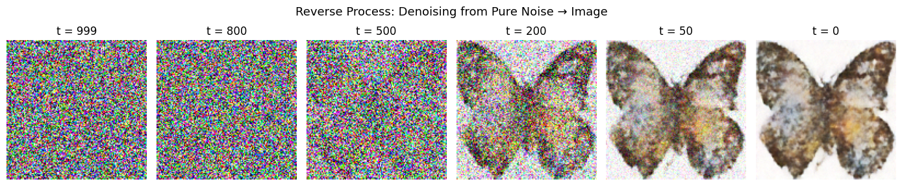
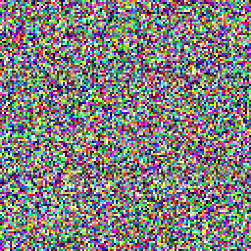

# Denoising Diffusion Probabilistic Models (DDPM)

**Paper:** Ho, Jain & Abbeel (2020) — [*Denoising Diffusion Probabilistic Models*](https://arxiv.org/abs/2006.11239)

A PyTorch implementation trained on the [Smithsonian Butterflies](https://huggingface.co/datasets/huggan/smithsonian_butterflies_subset) dataset.

---

## Overview

DDPMs learn to generate images by training a neural network to reverse a gradual noising process. The model is trained to predict the noise added at each timestep, and at inference time it iteratively denoises a sample of pure Gaussian noise into a coherent image.

### Denoising Process

The full reverse diffusion trajectory — from pure noise at $t=999$ to a generated butterfly at $t=0$:



Animated denoising (full 1000-step reverse process):



---

## Math & Implementation

### 1. Forward Process — Adding Noise

At each timestep $t$, Gaussian noise is added according to a variance schedule $\beta_t$:

$$
q(\mathbf{x}_t \mid \mathbf{x}_{t-1}) =
\mathcal{N}\left(\mathbf{x}_t; \sqrt{1-\beta_t}\mathbf{x}_{t-1}, \beta_t\mathbf{I}\right)
$$

**Linear variance schedule** — $\beta_t$ increases linearly from $\beta_1 = 10^{-4}$ to $\beta_T = 0.02$:

```python
def linear_beta_schedule(timesteps, beta_start=1e-4, beta_end=0.02):
    return torch.linspace(beta_start, beta_end, timesteps)

betas = linear_beta_schedule(T).to(device)   # β_t
alphas = 1.0 - betas                          # α_t = 1 - β_t
```

---

### 2. Closed-Form Noising (Reparameterization)

Rather than applying noise step-by-step, we can jump directly to any timestep $t$ using the cumulative product $\overline{\alpha}_{t} = \prod_{s=1}^{t} \alpha_{s}$

$$q(\mathbf{x}_t \mid \mathbf{x}_0) = \mathcal{N}\left(\mathbf{x}_t; \sqrt{\bar{\alpha}_t}\mathbf{x}_0, (1-\bar{\alpha}_t)\mathbf{I}\right)$$

Sampling via the reparameterization trick:

$$\mathbf{x}_t = \sqrt{\bar{\alpha}_t}\mathbf{x}_0 + \sqrt{1-\bar{\alpha}_t}\boldsymbol{\epsilon}, \qquad \boldsymbol{\epsilon} \sim \mathcal{N}(\mathbf{0}, \mathbf{I})$$

```python
alphas_cumprod = torch.cumprod(alphas, dim=0)               # ᾱ_t
sqrt_alphas_cumprod = torch.sqrt(alphas_cumprod)             # √ᾱ_t
sqrt_one_minus_alphas_cumprod = torch.sqrt(1.0 - alphas_cumprod)  # √(1-ᾱ_t)

def forward_diffusion(x_0, t, noise=None):
    if noise is None:
        noise = torch.randn_like(x_0)
    sqrt_alpha = sqrt_alphas_cumprod[t].reshape(-1, 1, 1, 1)
    sqrt_one_minus = sqrt_one_minus_alphas_cumprod[t].reshape(-1, 1, 1, 1)
    return sqrt_alpha * x_0 + sqrt_one_minus * noise, noise
```

---

### 3. Sinusoidal Timestep Embedding

The U-Net must know which timestep it is denoising. Timestep $t$ is encoded as a sinusoidal positional embedding (following Transformer notation):

$$\text{PE}(t, 2i) = \sin\left(\frac{t}{10000^{2i/d}}\right), \qquad \text{PE}(t, 2i+1) = \cos\left(\frac{t}{10000^{2i/d}}\right)$$

```python
class SinusoidalPositionEmbedding(nn.Module):
    def __init__(self, dim):
        super().__init__()
        self.dim = dim

    def forward(self, t):
        half_dim = self.dim // 2
        emb = np.log(10000) / (half_dim - 1)
        emb = torch.exp(torch.arange(half_dim, device=t.device) * -emb)
        emb = t.float().unsqueeze(1) * emb.unsqueeze(0)
        return torch.cat([torch.sin(emb), torch.cos(emb)], dim=1)
```

---

### 4. U-Net Architecture

The noise-prediction network $\boldsymbol{\epsilon}_\theta(\mathbf{x}_t, t)$ is a U-Net with time-conditioned residual blocks:

$$\boldsymbol{\epsilon}_\theta(\mathbf{x}_t, t) = \text{Decoder}\Big(\text{Encoder}(\mathbf{x}_t), \text{TimeEmbed}(t)\Big)$$

| Stage | Resolution | Channels |
|-------|-----------|----------|
| Input | 128×128 | 3 |
| enc1 | 128×128 | 128 |
| enc2 | 64×64 | 128 |
| enc3 | 32×32 | 256 |
| enc4 | 16×16 | 256 |
| bottleneck | 8×8 | 256 |
| dec4 | 16×16 | 256 |
| dec3 | 32×32 | 128 |
| dec2 | 64×64 | 128 |
| dec1 | 128×128 | 128 |
| Output | 128×128 | 3 |

Each `ResBlock` injects the time embedding via a linear projection added after the first convolution:

```python
class ResBlock(nn.Module):
    def __init__(self, in_ch, out_ch, time_dim):
        super().__init__()
        self.norm1   = nn.GroupNorm(8, in_ch)
        self.conv1   = nn.Conv2d(in_ch, out_ch, 3, padding=1)
        self.time_mlp = nn.Linear(time_dim, out_ch)   # time conditioning
        self.norm2   = nn.GroupNorm(8, out_ch)
        self.conv2   = nn.Conv2d(out_ch, out_ch, 3, padding=1)
        self.shortcut = nn.Conv2d(in_ch, out_ch, 1) if in_ch != out_ch else nn.Identity()

    def forward(self, x, t_emb):
        h = self.conv1(F.silu(self.norm1(x)))
        h = h + self.time_mlp(F.silu(t_emb)).unsqueeze(-1).unsqueeze(-1)
        h = self.conv2(F.silu(self.norm2(h)))
        return h + self.shortcut(x)
```

---

### 5. Training Objective

The full ELBO simplifies to a **noise prediction** MSE loss (Ho et al., 2020):

$$L_{\text{simple}} = \mathbb{E}_{t, \mathbf{x}_0, \boldsymbol{\epsilon}} \Big[\left\| \boldsymbol{\epsilon} - \boldsymbol{\epsilon}_\theta\left(\mathbf{x}_t, t\right) \right\|^2 \Big]$$

```python
def train_one_epoch(model, dataloader, optimizer, scheduler):
    model.train()
    for x_0, _ in dataloader:
        x_0 = x_0.to(device)
        t     = torch.randint(0, T, (x_0.shape[0],), device=device)  # random timestep
        noise = torch.randn_like(x_0)                                  # ε ~ N(0, I)
        x_t, _ = forward_diffusion(x_0, t, noise)                     # noisy image
        loss = F.mse_loss(model(x_t, t), noise)                        # ‖ε - ε_θ‖²

        optimizer.zero_grad()
        loss.backward()
        nn.utils.clip_grad_norm_(model.parameters(), max_norm=1.0)
        optimizer.step()
        scheduler.step()
```

The optimizer is **AdamW** with a linear warmup over the first 5 epochs followed by cosine decay.

---

### 6. Reverse Process — Sampling

Starting from $\mathbf{x}_T \sim \mathcal{N}(\mathbf{0}, \mathbf{I})$, images are generated by iteratively applying:

$$\mathbf{x}_{t-1} = \frac{1}{\sqrt{\alpha_t}} \left( \mathbf{x}_t - \frac{\beta_t}{\sqrt{1 - \bar{\alpha}_t}}\boldsymbol{\epsilon}_\theta(\mathbf{x}_t, t) \right) + \sqrt{\beta_t}\mathbf{z}, \qquad \mathbf{z} \sim \mathcal{N}(\mathbf{0}, \mathbf{I})$$

```python
@torch.no_grad()
def sample(model, n_samples=16):
    model.eval()
    x = torch.randn(n_samples, CHANNELS, IMG_SIZE, IMG_SIZE, device=device)
    for t_val in reversed(range(T)):
        t_batch = torch.full((n_samples,), t_val, device=device, dtype=torch.long)
        eps_pred = model(x, t_batch)
        alpha_t    = alphas[t_val]
        alpha_bar_t = alphas_cumprod[t_val]
        beta_t     = betas[t_val]
        mu = (1.0 / alpha_t.sqrt()) * (x - beta_t / (1.0 - alpha_bar_t).sqrt() * eps_pred)
        x  = mu + beta_t.sqrt() * torch.randn_like(x) if t_val > 0 else mu
    return (x.clamp(-1, 1) + 1) / 2
```

---

## Hyperparameters

| Parameter | Value |
|-----------|-------|
| Image size | 128×128 |
| Channels | 3 (RGB) |
| Diffusion steps $T$ | 1000 |
| Batch size | 32 |
| Epochs | 20 |
| Learning rate | 2×10⁻⁴ |
| LR warmup | 5 epochs |
| Optimizer | AdamW |
| Grad clip | 1.0 |
| U-Net base channels | 128 |
| Time embedding dim | 256 |
